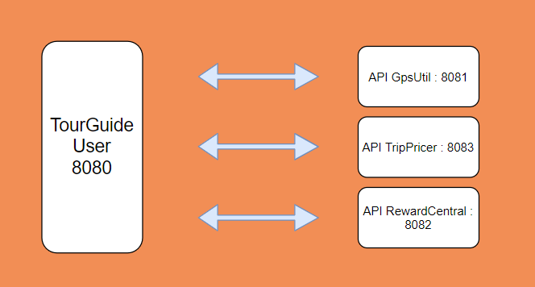

TourGuide Application - Microservices

<h2>Prérequis :</h2>

* Java 1.8
* Gradle
* Docker

<h2>Microservices : </h2>

* **`TourGuide`** : Application centrale reliant les API (**localhost:8080**)
* **`GpsUtil`** : API de localisation (**localhost:8081**) https://github.com/Nico-GS/TourGuide-Application/tree/master/gpsUtil
* **`RewardCentral`** : API d'obtention des récompenses utilisateurs (**localhost:8082**) https://github.com/Nico-GS/TourGuide-Application/tree/master/rewardCentral
* **`TripPricer`** : API d'obtention des prix des attractions et des providers disponibles (**localhost:8083**) https://github.com/Nico-GS/TourGuide-Application/tree/master/tripPricer

<h2> Architecture : </h2>

<h2> Docker </h2>

Container Docker disponible ici :

* TourGuide : https://hub.docker.com/r/lornmalvo/tourguide
* TripPricer : https://hub.docker.com/r/lornmalvo/trippricer
* RewardCentral : https://hub.docker.com/r/lornmalvo/rewardcentral
* GpsUtil : https://hub.docker.com/r/lornmalvo/gpsutil

Pour lancer les container en local : 

**docker pull lornmalvo/"name"**

<h2> Documentation de l'API </h2>

La documentation des endpoints a été générée avec Swagger :

localhost:8080/swagger-ui.html

<h2> Tests de performances de l'application </h2>

La documentation est disponible -> ici <- 